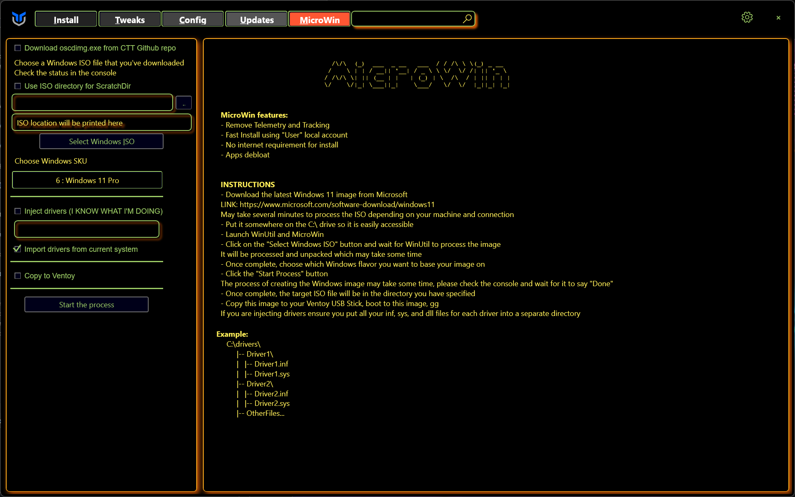
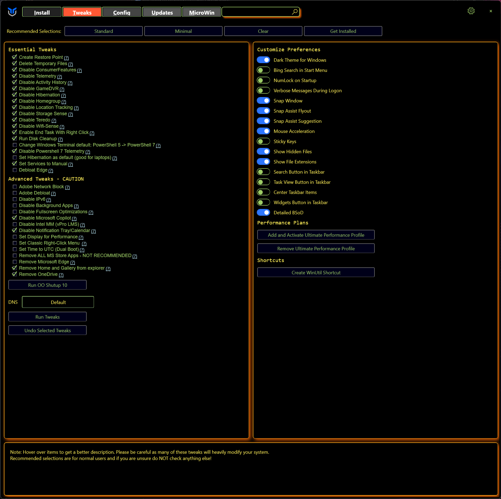
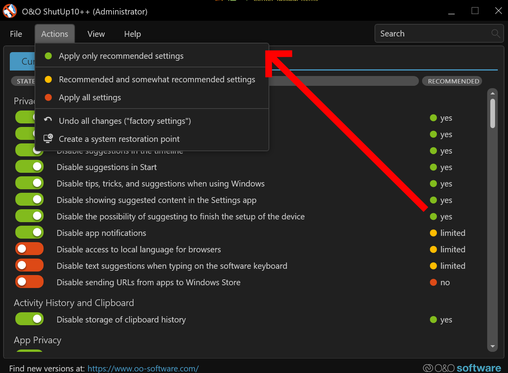

# Improve-Windows-11

This guide is intended to describe my personal process for improving Windows 11 to my liking. Not every step is required or "everyone needs to do this!". You can remove a lot of the telemetry and bloat from Windows just by running `winutil` and running several tweaks. But I always prefer to just re-install Windows fresh every so often. Here's every step in that process as of August 2024 :)

## Table of Contents
* [Back up!](#back-up-before-making-major-changes)
* [Debloating Windows ISO](#debloating-windows-iso)
* [Improving Windows 11](#improving-windows-11)
* [Customizing Windows 11](#customizing-windows-11)

## Back-up before making major changes

Heed my warning. Always backup your system just in case something goes horribly wrong.

## Debloating Windows ISO

This first part involves debloating with `winutil`'s Microwin function. This will remove a lot of telemetry and optional programs that Microsoft includes with Windows.

Winutil Site: https://christitustech.github.io/winutil/

Microwin site: https://christitustech.github.io/winutil/userguide/#microwin

> **_Note: This is not required if you want to debloat Windows. Only do this if you're going to (re-)install Windows anyways._**

Here are the following steps:

### 1. Run [`winutil`](https://github.com/ChrisTitusTech/winutil)

A lot of this process requires using [@ChrisTitusTech](https://github.com/ChrisTitusTech)'s [`winutil`](https://github.com/ChrisTitusTech/winutil) tool. The steps to run this tool are on the Github repo. But for posterity's sake:

1. Right click start menu.
2. Open Powershell or Terminal in Admin mode.
3. Run `irm "https://christitus.com/win" | iex`

### 2. Preparing the ISO

1. Download a Windows 11 ISO from Microsoft: https://www.microsoft.com/en-gb/software-download/windows11
2. Go to the `Microwin` tab on `winutil`.
3. Click `Select Windows ISO`.
4. You'll likely be prompted to download and install `oscdimg.exe` to select the ISO. Perform this process.
5. After installing `oscdimg.exe`, restart `winutil`.
6. Select the Windows ISO you downloaded. It will take sometime for it load the ISO.
7. Select the version you want (I pick Windows 11 Pro).
9. Select `Import drivers from current system`. This is helpful since you won't have to reinstall your drivers from the internet.

10. `Start the process`.

After this, the tool should begin the process of the creating the modified ISO.

Once created, go ahead and use [Rufus](https://rufus.ie/) or [balenaEtcher](https://etcher.balena.io/) to flash the ISO onto a thumb drive.

### 3. Install Windows

Self-explanatory. Nothing special needs to be down here.

### 4. Boot into Windows and run Windows Update. Install all new updates and restart.

### 5. Install your programs again 😄

## Improving Windows 11

This section will cover running `winutil` and disabling a lot of the telemetry, removing some programs, and changing some of Windows settings and behavior.

> **_Note: Everytime you run Windows update and restart, you may have to re-enable these tweaks._**

### 1. Run `winutil`. [See section above for how.](#1-run-winutil)
### 2. Go to the `Tweaks` tab.
### 3. Enable the Tweaks you would like. This is what I typically run and have enabled:

### 4. Click `Run Tweaks`. Let this part finish.
### 5. Click `Run OO Shutup 10`.
### 6. Go to `Actions` and click `Apply only recommended settings`

You should now be running a much improved Windows 11 install, with most of the telemetry disabled, no Bing search in the startment, and stuff like Copilot and OneDrive completely disabled or uninstalled.

## Customizing Windows 11

TBD :)

