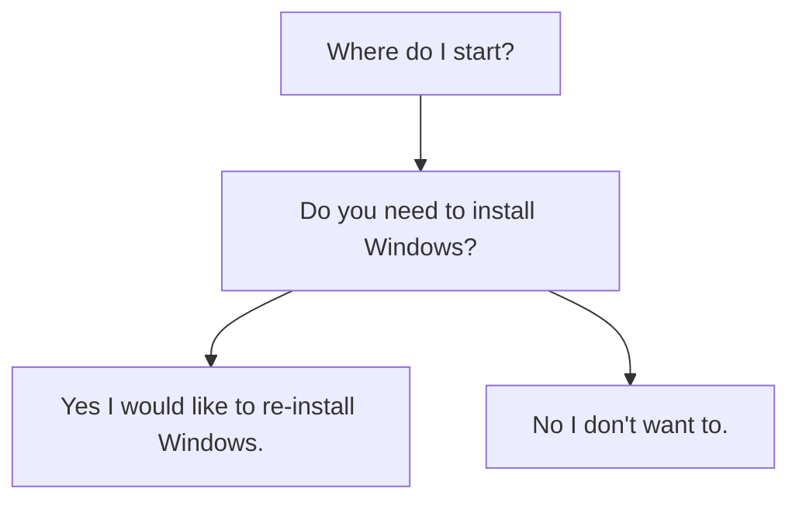
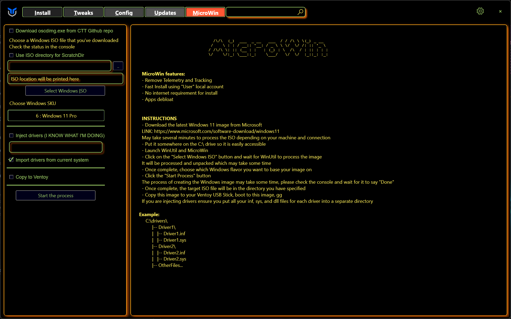
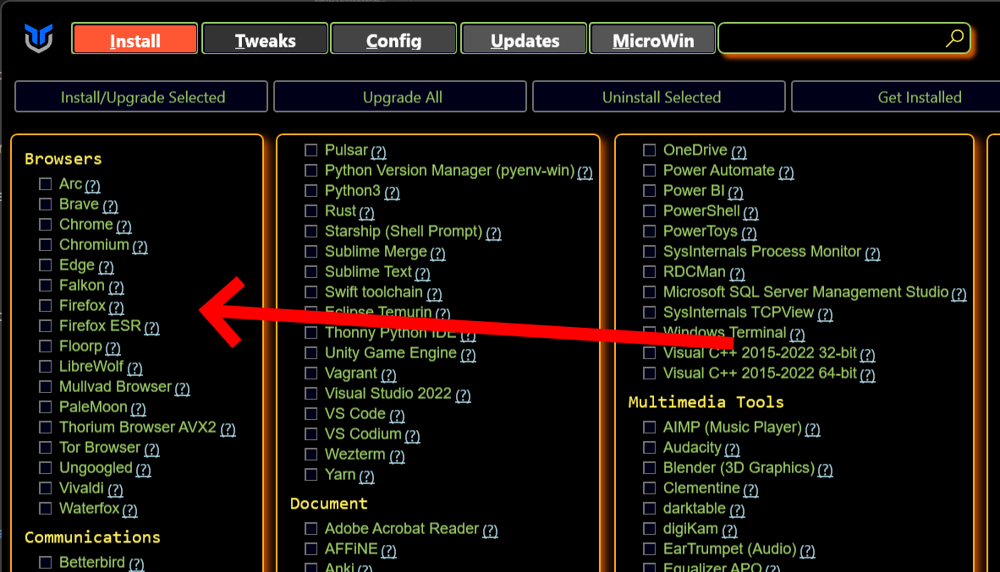
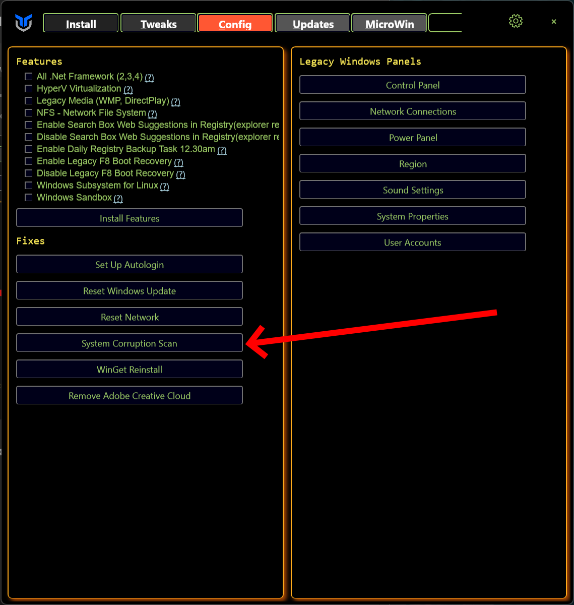
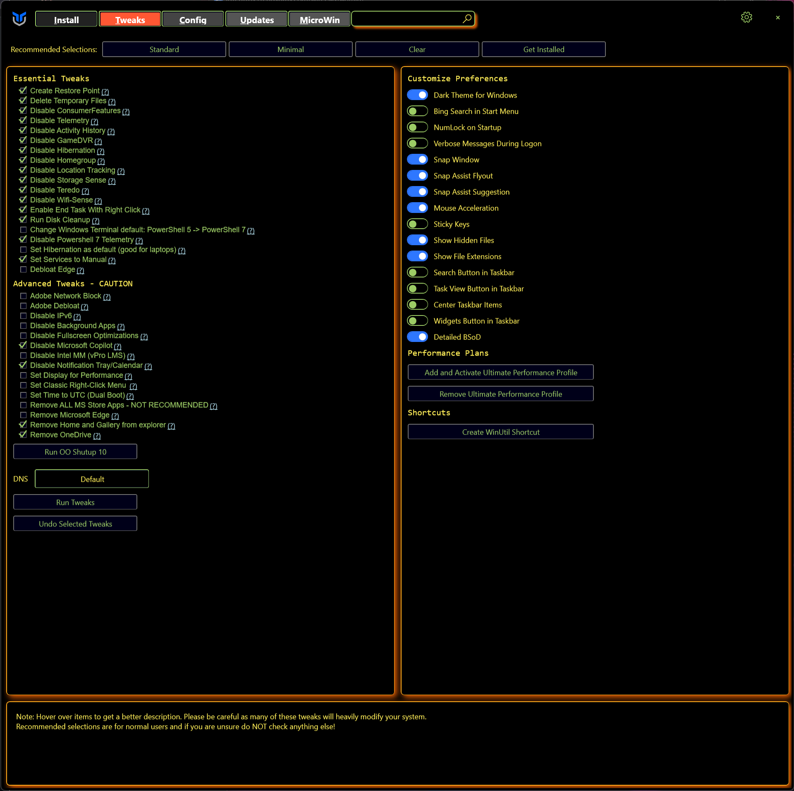
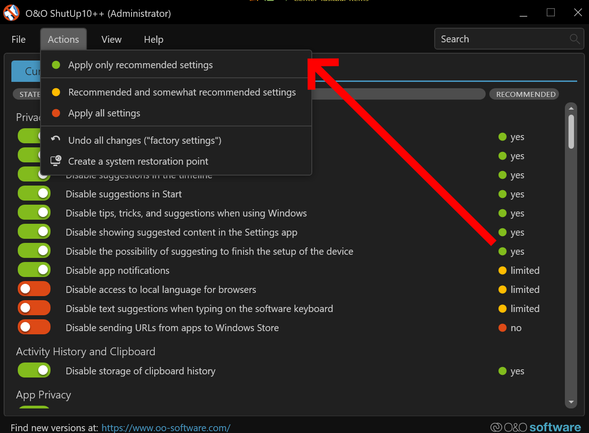
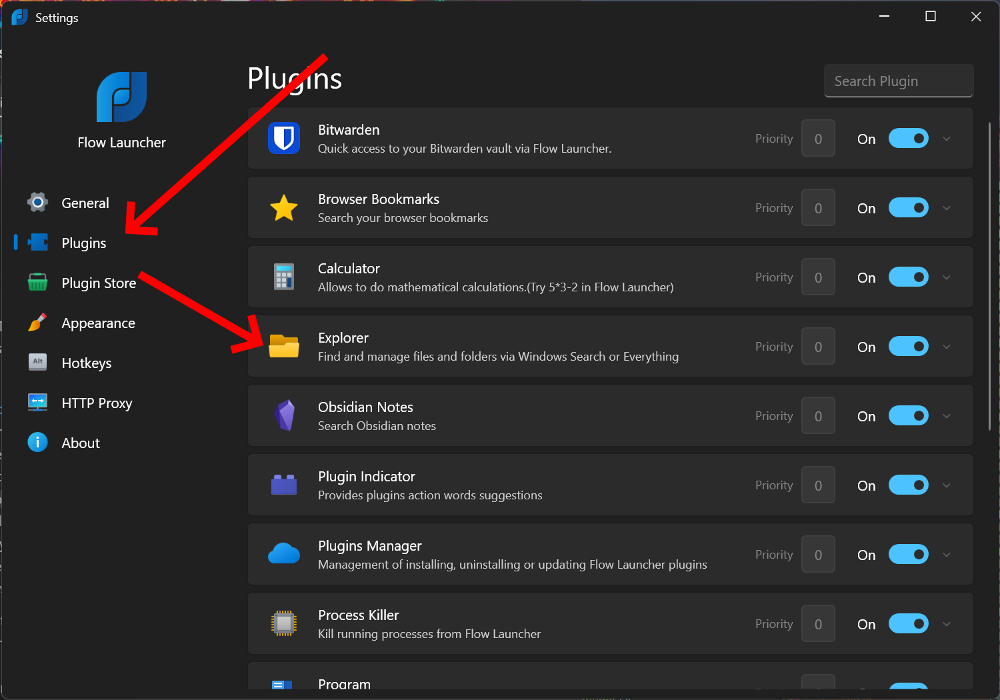
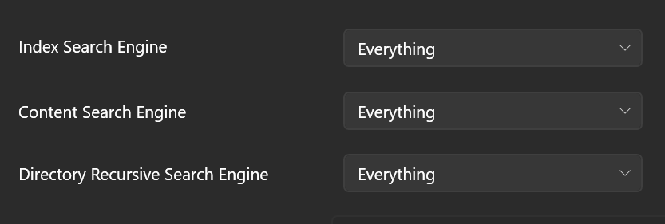
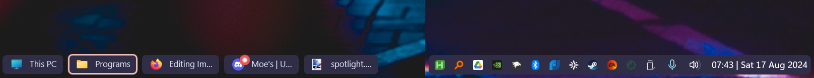

# Improve Windows 11 Personal Guide

This guide is intended to describe my personal process for improving Windows 11 to my liking. Not every step is required or "everyone needs to do this!". You can remove a lot of the telemetry and bloat from Windows just by running `winutil` and running several tweaks. But I always prefer to just re-install Windows fresh every so often. Here's every step in that process as of August 2024 :)

## Table of Contents

- [Back up!](#back-up-before-making-major-changes)
- [Debloating Windows ISO](#debloating-windows-iso)
- [Improving Windows 11](#improving-windows-11)
- [Customizing Windows 11](#customizing-windows-11)

## **Warning**

- Always backup your system just in case something goes horribly wrong.

- Read whatever links I provide so you can get a good understanding of what is happening to the system.

- I am not liable for anything that may go wrong here. Do not expect me to provide support. This is a guide I am writing for myself for future reference.

## Ok great! Where do I start?

## Debloating Windows ISO

> **_Note: This is not required if you want to debloat Windows. Only do this if you're going to (re-)install Windows anyways._**

This first part involves debloating with `winutil`'s Microwin function. This will remove a lot of telemetry and optional programs that Microsoft includes with Windows.

> **_IMPORTANT: Microsoft Edge will be uninstalled as of 2024-08-18. You will have to install another browser via `winutil` after installing Windows._**

Winutil Site: https://christitustech.github.io/winutil/

Microwin site: https://christitustech.github.io/winutil/userguide/#microwin

Here are the following steps:

### 1. Run [`winutil`](https://github.com/ChrisTitusTech/winutil)

A lot of this process requires using [@ChrisTitusTech](https://github.com/ChrisTitusTech)'s [`winutil`](https://github.com/ChrisTitusTech/winutil) tool. The steps to run this tool are on the Github repo. But for posterity's sake:

1. Right click start menu.
2. Open Powershell or Terminal in Admin mode.
3. Run `irm "https://christitus.com/win" | iex`

### 2. Preparing the ISO

1. Download a Windows 11 ISO from Microsoft: https://www.microsoft.com/en-gb/software-download/windows11
2. Go to the `Microwin` tab on `winutil`.
3. Click `Select Windows ISO`.
4. You'll likely be prompted to download and install `oscdimg.exe` to select the ISO. Perform this process.
5. After installing `oscdimg.exe`, restart `winutil`.
6. Select the Windows ISO you downloaded. It will take sometime for it load the ISO.
7. Select the version you want (I pick Windows 11 Pro).
8. Select `Import drivers from current system`. This is helpful since you won't have to reinstall your drivers from the internet.
   
9. `Start the process`.

After this, the tool should begin the process of the creating the modified ISO.

Once created, go ahead and use [Rufus](https://rufus.ie/) or [balenaEtcher](https://etcher.balena.io/) to flash the ISO onto a thumb drive.

### 3. Install Windows

Self-explanatory. Nothing special needs to be down here.

### 4. Boot into Windows and run Windows Update. Install all new updates and restart.

### 5. Run `winutil` again and install your preferred browser of choice.

> **_Note: You may have to install Microsoft Edge even if you don't use it. I was having issues with the Xbox and the Minecraft launcher signing in._**

Check the box of the browser you'd like. Click `Install/Upgrade Selected` and the tool should begin the download and installation process for you.

### 6. Install your programs again 😄

You can use `winutil` for this but I will leave that choice up to you.

### Some issues you may run into...

#### Xbox and Minecraft Launcher not working

You may have to install Microsoft Edge in case the Xbox and Minecraft apps aren't working. Microsoft bundles Edge was some components that are required for these 2 apps.

After re-installing Edge, and running `System Corruption Scan` from `winutil`, this resolved my issues.

#### Java Installation

For some reason the Java offline installer didn't work properly for me. What I had to do was delete `C:\Program Files\Java` and use the online installer instead.

## Improving Windows 11

This section will cover running `winutil` and disabling a lot of the telemetry, removing some programs, and changing some of Windows settings and behavior.

> **_Note: Everytime you run Windows update and restart, you may have to re-enable these tweaks._**

1. Run `winutil`. [See section above for how.](#1-run-winutil)
2. Go to the `Tweaks` tab.
3. Enable the Tweaks you would like. This is what I typically run and have enabled:
   
4. Click `Run Tweaks`. Let this part finish.
5. Click `Run OO Shutup 10`.
6. Go to `Actions` and click `Apply only recommended settings`
   

You should now be running a much improved Windows 11 install, with most of the telemetry disabled, no Bing search in the startment, and stuff like Copilot and OneDrive completely disabled or uninstalled.

## Customizing Windows 11

Any programs I install here are installed via `winutil`. But I will also provide links.

### MacOS-like Spotlight Search

Hate Windows Search? Me too. This is how you get MacOS-like Spotlight Search functionality on Windows. The steps here will download and install, AutoHotKey, Flow Launcher, and setup a script to always launch Flow Launcher instead of Windows Search.

1. Download and install [AutoHotKey](https://www.autohotkey.com/)
2. Create a new script with the following [code](UseFlow.ahk). This code was not written by me, code is from this [Reddit post](https://old.reddit.com/r/FlowLauncher/comments/110uc4t/windows_key_to_open_flow_with_autohotkey_script/).
3. Compile this script to an exe.
4. Copy the shortcut of the compiled .exe into `C:\ProgramData\Microsoft\Windows\Start Menu\Programs\Startup`
5. Now download and install [Flow Launcher](https://www.flowlauncher.com/).
6. When setting the main key for Flow Launcher, make sure to hit the Windows key again. It should see `Left Alt + F24` instead of the Windows key. The reason we use `Left Alt + F24` is because the launcher doesn't allow the Windows key to be remapped.

Now Flow should be referenced for search instead of Windows search. If you have the default Windows 11 taskbar, it may reference Windows search instead.

#### Improve Flow Launcher's Indexing

Something I discovered is that by default, the Flow Launcher doesn't index everything. However, this is a quick and simple fix.

1. Open up settings in Flow Launcher by searching `Setting`.
2. Open that up and go to `Plugins` > `Explorer`
   
3. Set `Index Search Engine`, `Content Search Engine`, and `Directory Recursive Search Engine` to `Everything`.
   

### Modify Taskbar

This next part covers modifying the Windows taskbar to your liking. The main motiviation for this part is aesthetic purposes.

1. Download and install [Windhawk](https://windhawk.net/).
2. Install the following mods:
   - Taskbar Clock Customization
   - Taskbar height and icon size
   - Taskbar Labels for Windows 11
   - Windows 11 Taskbar Styler
3. Settings for clock customization. Anything relating to the web is not shown.
   - Time format: `hh':'mm'`
   - Date format: `ddd dd MMM yyyy`
   - Week day format: `dddd`
   - Top line: Empty
   - Bottom Line: `%time% | %date%`
   - Middle line (Windows 10 only): `%weekday%`
   - Clock width (Windows 10 only): `180`
   - Clock height (Windows 10 only): `60`
   - Text spacing: `1`
4. Settings for Taskbar height and icon size.
   - Icon size: `16`
   - Taskbar height: `24`
   - Taskbar button width: `37`
5. Settings for Taskbar Labels for Windows 11.
   - Taskbar item width: `0`
   - Minimum taskbar item width: `0`
   - Maximum taskbar item width: `100`
   - Running indicator style: `Full width`
   - Progress indicator style: `Full width`
   - Font size: `11`
   - Left and right padding size: `12`
   - Space between icon and label: `14`
   - Label for a single item: `%name%`
   - Label for multiple items: `[%amount%] %name%`
6. Settings for Windows 11 Taskbar Styler.
   - Theme: `RosePine`

## Final Result after each step:

